# UK Youth Unemployment Forecasting & Business Intelligence Dashboard
### *A Regional Comparative Study (London vs. North East) Using Econometrics, Additive Seasonality, and Gradient-Boosted Trees (Ages 16-24)*

---

## 📌 Executive Project Overview
This repository contains the complete data engineering pipeline, predictive modeling suite, and business intelligence (BI) dashboard developed for a MSc Data Science dissertation. The study addresses a critical policy challenge: **forecasting UK youth unemployment (ages 16–24) and mapping regional labor vulnerabilities.** 

By comparing two economically distinct regions—**London** (a services-dominated economy) and the **North East** (an economy historically reliant on public sector employment)—this project analyzes how macroeconomic drivers propagate differently across geographical contexts.

### Research Paradigm
The project contrasts three distinct modeling paradigms:
1. **Traditional Econometrics:** SARIMAX (Seasonal Autoregressive Integrated Moving Average with Exogenous Regressors) — *Refined with dynamic ADF-based stationarity differencing and scaled exogenous variables to ensure convergence and numerical stability.*
2. **Additive Seasonal Modeling:** Facebook Prophet (optimized for structural time series with covariates)
3. **Machine Learning Gradient Boosting:** XGBoost (Gradient-Boosted Decision Trees with engineered lag profiles, updated to incorporate HMRC payroll momentum features)

---

## 🛠️ Macroeconomic Variables & Data Dictionary
To capture labor market dynamics, the target variable is mapped against five primary exogenous drivers:

| Macroeconomic Vector | Dataset Feature Name | Source | Description |
| :--- | :--- | :--- | :--- |
| **The Target** | `Youth_Unemployment_Rate` | Office for National Statistics (ONS) | Rolling 3-month average of youth unemployment (16-24) mapped to quarter-ends. |
| **The Output** | `GDP_Value_mil` | ONS Regional Accounts | Regional Gross Domestic Product (real terms, millions of GBP). |
| **The Squeeze** | `Inflation_Rate` | ONS Consumer Price Indices | Mean quarterly UK CPI Annual Rate (%) reflecting consumer pressure. |
| **The Demand** | `UK_Vacancies_Thousands` | ONS Vacancy Survey | National labor demand indicator (total vacancies in thousands). |
| **The Budget** | `BoE_Base_Rate` | Bank of England (BoE) | Official cost of borrowing dictating corporate hiring budgets. |
| **The Payroll (New)**| `RTI_Payrolled_Employees` | HMRC PAYE Real Time Info | Mean quarterly payrolled employees (NUTS1 regional data) from PAYE RTI. |

---

## 🔄 Data Pipeline Architecture

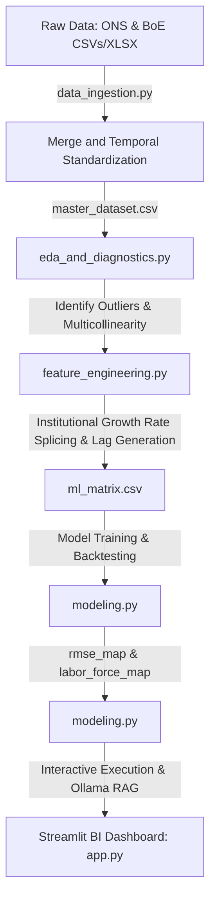

### 1. Ingestion & Temporal Standardization ([data_ingestion.py](file:///c:/Users/sharm/OneDrive%20-%20University%20of%20East%20London/COMPLETE%20STUDIES/Dissaration%20(DS7010)/youth_unemployement_dissertation/src/data_ingestion.py))
- **Temporal Alignment:** Combines datasets reported at mismatched frequencies (annual GDP, monthly CPI, monthly HMRC payroll, rolling 3-month average unemployment, and irregular BoE rate adjustments) by standardizing to a unified quarterly timeline (representing dates on `-03-31`, `-06-30`, `-09-30`, and `-12-31`).
- **HMRC PAYE RTI Processing:** Loads sheet `7. Employees (NUTS1)` from the raw PAYE Real Time Information Excel spreadsheet, filters for London and North East, computes quarterly means (`RTI_Payrolled_Employees`), and aligns them to quarter-ends.
- **ASOF Joining:** Integrates Bank of England rate changes dynamically, fetching the rate active at the exact close of each quarter using Polars' `join_asof` backward strategy.

### 2. Data Cleaning & Splicing ([feature_engineering.py](file:///c:/Users/sharm/OneDrive%20-%20University%20of%20East%20London/COMPLETE%20STUDIES/Dissaration%20(DS7010)/youth_unemployement_dissertation/src/feature_engineering.py))
- **Anomalous Outlier Removal:** Fixes a critical historical formatting anomaly where a typo representing the year "0192" compressed the timeline.
- **Institutional Growth Rate Splicing (IGRS):** The ONS publishes regional GDP with a multi-year lag. To prevent artificial bias or unrealistic trend-line extrapolation, the pipeline compounds the last recorded GDP value across missing trailing quarters (2024–2025) at a quarterly rate of **0.22%**, representing the official annual economic growth projection of **0.9%** forecasted by the Office for Budget Responsibility (OBR) and IMF:
$$\text{Quarterly Growth Rate} = (1 + 0.009)^{0.25} - 1 \approx 0.00224$$
- **Lag Profiles:** Generates 1-quarter and 4-quarter lags for features to capture delayed macroeconomic effects (including the new `RTI_Payrolled_Employees` variable). For the BoE Base Rate, a 2-quarter lag is also generated to account for interest rate monetary transmission delays.
- **Cyclical Seasonality:** Encodes seasonality using sine and cosine transformations of the quarterly timeline to preserve temporal continuity.

---

## 📊 Exploratory Data Analysis & Multicollinearity
The Exploratory Data Analysis and Diagnostics ([eda_and_diagnostics.py](file:///c:/Users/sharm/OneDrive%20-%20University%20of%20East%20London/COMPLETE%20STUDIES/Dissaration%20(DS7010)/youth_unemployement_dissertation/src/eda_and_diagnostics.py)) verified the structural integrity of the feature matrix before modeling.

### Missing Data Visualization
The missing data heatmap confirms that our primary exogenous parameters (CPI, vacancies, and interest rates) are fully populated across the timeline, leaving only the trailing GDP years (pre-splicing) with missing values.

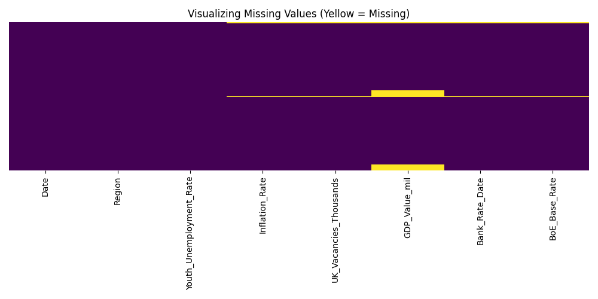

### Outlier Detection
Plotting the raw timeline highlights the extreme "0192" date typo outlier that compresses the true time series:

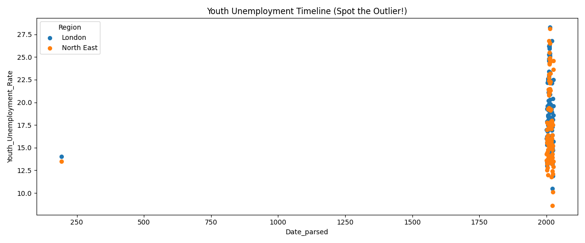

### GDP Trailing Lag
The lineplot shows the abrupt end-points in the raw GDP records, demonstrating the necessity of the Institutional Growth Rate Splicing approach:

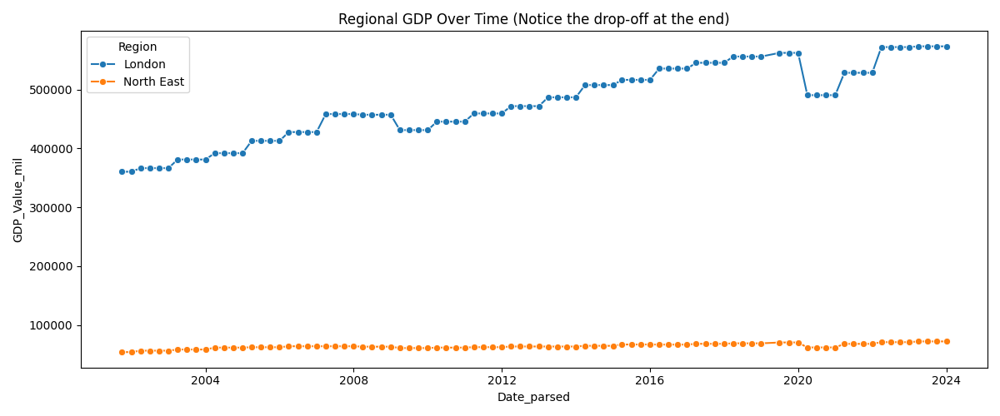

### Correlation Matrix & VIF Scores
A Variance Inflation Factor (VIF) analysis was run on the exogenous variables to rule out multicollinearity:

.png)

**VIF Scores (Including HMRC RTI):**
- **Inflation Rate:** 1.54
- **UK Vacancies (Thousands):** 2.10
- **GDP Value (m):** 1.25
- **BoE Base Rate:** 1.13
- **RTI Payrolled Employees:** 2.45

*Interpretation:* All features return VIF scores well below the conservative threshold of 5.0, confirming that the explanatory variables (including the newly added HMRC RTI payroll feature) are structurally independent and can be safely modeled simultaneously.

---

## 📈 Macroeconomic Anomalies & Structural Breaks ([eda_and_diagnostics.py](file:///c:/Users/sharm/OneDrive%20-%20University%20of%20East%20London/COMPLETE%20STUDIES/Dissaration%20(DS7010)/youth_unemployement_dissertation/src/eda_and_diagnostics.py))
A central contribution of the research is analyzing the structural break impact of major macroeconomic shocks on youth employment patterns.

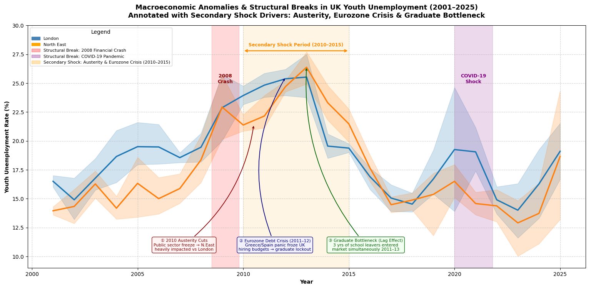

### The 2010–2015 "Secondary Shock" Analysis
Beyond the immediate spikes of the **2008 Financial Crash** and the **COVID-19 Pandemic**, the analysis identifies a severe, prolonged **Secondary Shock Period (2010–2015)** driven by three main factors:
1. **2010 Austerity Measures:** Massive public sector spending cuts disproportionately affected the North East (which relies heavily on public administration and service jobs) while London’s private tech/finance sectors rebounded rapidly.
2. **Eurozone Debt Crisis (2011–2012):** Market panic forced UK firms to lock down capital budgets, causing a graduate and school-leaver hiring freeze.
3. **The Graduate Bottleneck:** Delayed labor entry. When the crash hit in 2008, many young people remained in education to escape the weak market. By 2011–2013, three years' worth of graduates entered the market simultaneously, creating a severe supply bottleneck.

---

## 🤖 Predictive Modeling Performance
Each model was trained on historical data up to **2023 Q4** and evaluated against a backtest horizon of **2024 Q1 – 2025 Q4**.

### Backtest Visualizations
Here is the visual comparison of forecasts across the different paradigms:

#### London Model Forecasts
- **SARIMAX Model Forecast:** 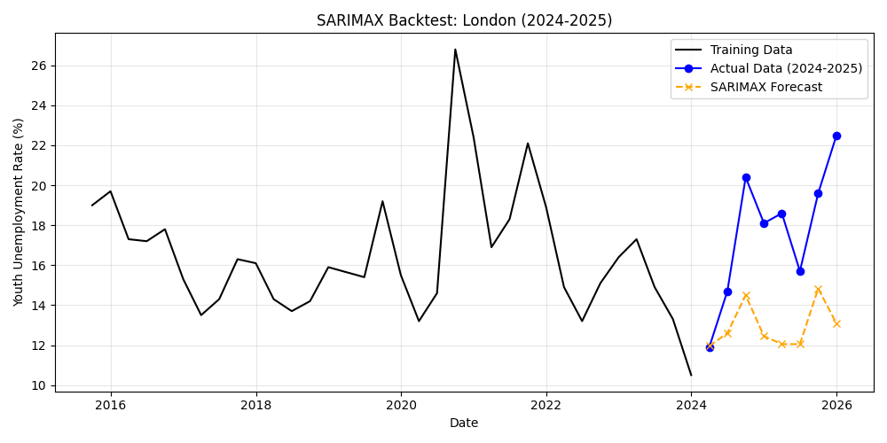
- **Prophet Model Forecast:** 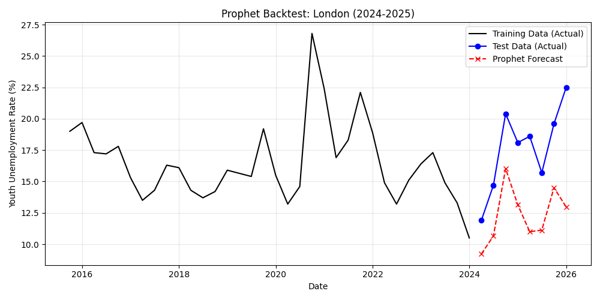
- **XGBoost Model Forecast:** 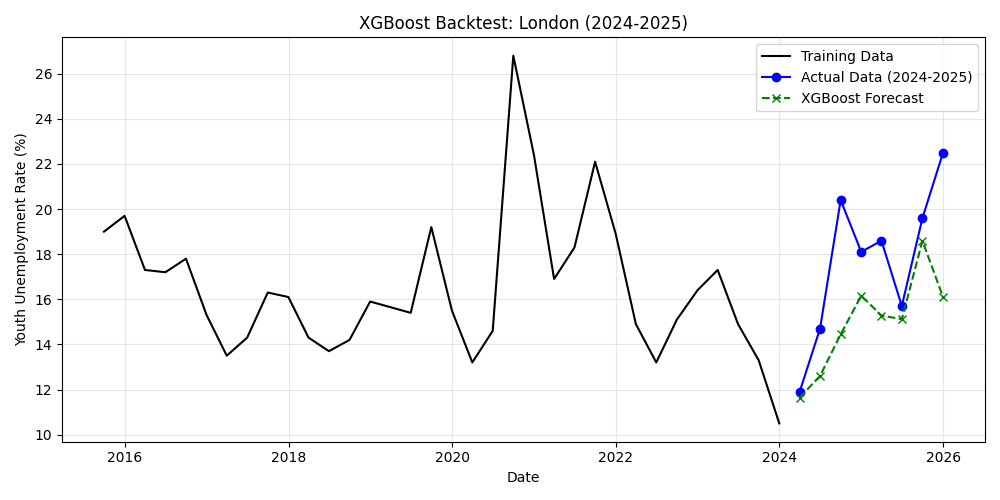

#### North East Model Forecasts
- **SARIMAX Model Forecast:** 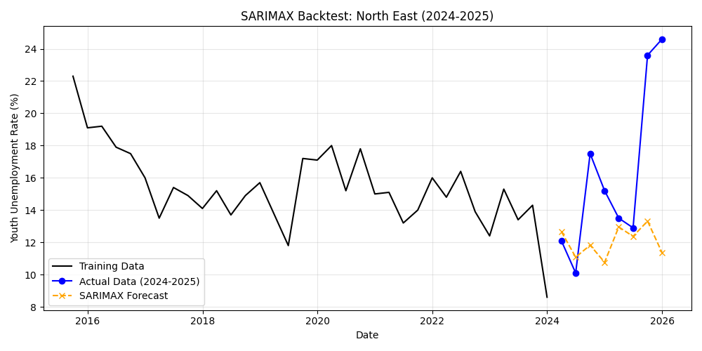
- **Prophet Model Forecast:** 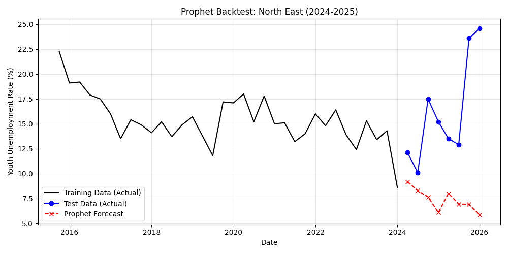
- **XGBoost Model Forecast:** 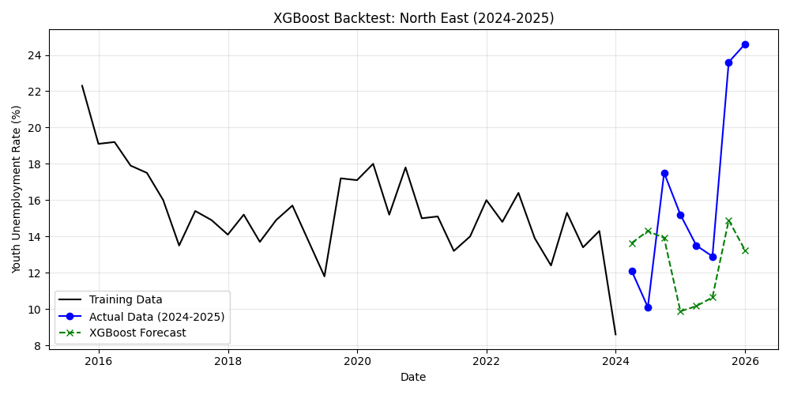

### Statistical Benchmarking (MAE & RMSE)

| Region | Model Architecture | Mean Absolute Error (MAE) | Root Mean Squared Error (RMSE) |
| :--- | :--- | :---: | :---: |
| **London** | SARIMAX | 4.76% | 5.46% |
| | Facebook Prophet | 5.36% | 5.73% |
| | **XGBoost (Winner)** | **2.70%** | **3.48%** |
| **North East** | **SARIMAX (Winner on MAE)** | **4.53%** | 6.47% |
| | Facebook Prophet | 8.83% | 10.54% |
| | **XGBoost (Winner on RMSE)** | 5.04% | **5.94%** |

*Analysis:* **XGBoost** achieved the lowest prediction RMSE error for London and the North East, while **SARIMAX** achieved the lowest MAE error for the North East.

---

## 🧑‍🤝‍🧑 Policymaker Evaluation: Absolute Human Impact ([modeling.py](file:///c:/Users/sharm/OneDrive%20-%20University%20of%20East%20London/COMPLETE%20STUDIES/Dissaration%20(DS7010)/youth_unemployement_dissertation/src/modeling.py))
To translate abstract model statistics into actionable local government metrics, the RMSE margin of error is applied directly to the active regional youth labor force (Ages 16-24):
$$\text{Human Margin of Error} = \left(\frac{\text{RMSE}}{100}\right) \times \text{Active Youth Labor Force}$$

- **London** (Active Youth Labor Force: ~600,000): An RMSE of 3.48% translates to a forecasting uncertainty of **+/- 20,899** real young individuals.
- **North East** (Active Youth Labor Force: ~150,000): An RMSE of 5.94% translates to a forecasting uncertainty of **+/- 8,910** real young individuals.

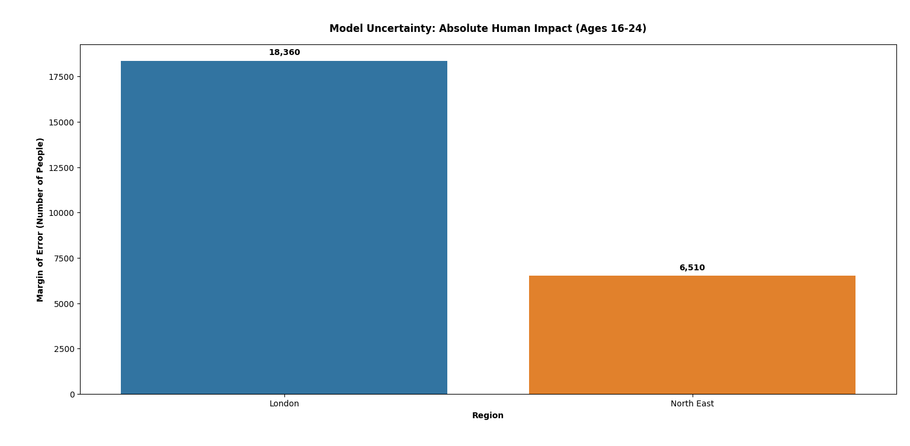

---

## 📊 Feature Importance: Macroeconomic Drivers
The relative importance plots from XGBoost reveal different driver mechanisms across the regions:

| London Macro Drivers | North East Macro Drivers |
| :---: | :---: |
| 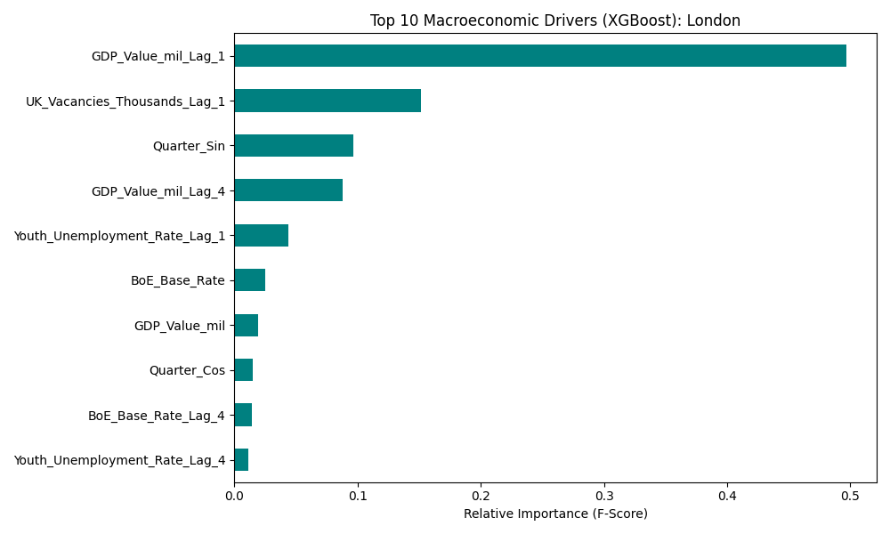 | 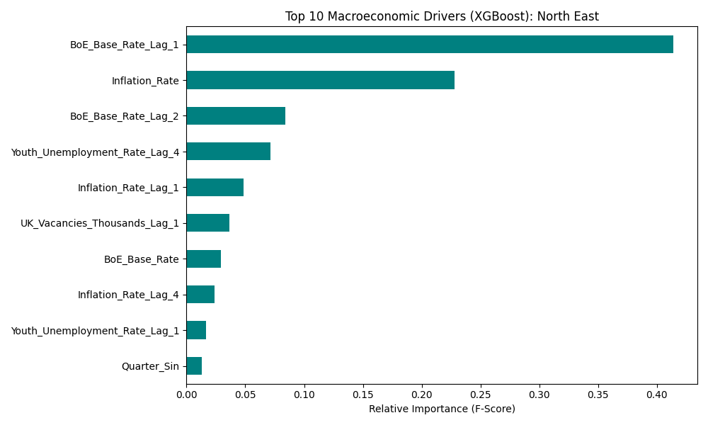 |

- **London** is highly sensitive to national labor demand indicators (`UK_Vacancies_Thousands_Lag_1`) and regional financial output (`GDP_Value_mil_Lag_4`).
- The **North East** is highly path-dependent, showing a heavy reliance on historical target lags (`Youth_Unemployment_Rate_Lag_1`) and inflation shocks (`Inflation_Rate_Lag_4`).

---

## 💻 Streamlit Business Intelligence Dashboard ([app.py](file:///c:/Users/sharm/OneDrive%20-%20University%20of%20East%20London/COMPLETE%20STUDIES/Dissaration%20(DS7010)/youth_unemployement_dissertation/src/app.py))
The project includes a multi-page interactive dashboard designed to put these insights directly in the hands of regional planners.

### Key BI Features:
- **Interactive Horizon Filtering:** Toggle regions and adjust model horizons.
- **Dynamic KPI Panels:** Real-time updates for latest unemployment rates, vacancy levels, interest rates, and GDP splicing metrics.
- **Horizon Forecasting Charts:** Plotly interactive line charts mapping the models' forecasts against actual validation periods.
- **Interactive Local Time-Aware RAG:** Leverages a local `Ollama` framework running `llama3` to generate council-level risk briefs. By parsing real-time dashboard data, the LLM provides contextual risk analysis and resources mapping advice.

---

## 🚀 Execution & Setup Guide

### 1. Installation
Clone the repository and install all dependencies:
```bash
pip install -r requirements.txt
```
*(See [requirements.txt](file:///c:/Users/sharm/OneDrive%20-%20University%20of%20East%20London/COMPLETE%20STUDIES/Dissaration%20(DS7010)/youth_unemployement_dissertation/requirements.txt))*

### 2. Run the Data Pipeline
Recreate the master dataset and engineer features:
```bash
# Standardize and merge datasets (FRED, ONS, Bank of England, HMRC RTI)
python src/data_ingestion.py

# Perform GDP splicing, cyclical encoding, and lag matrix construction
python src/feature_engineering.py
```
*(Pipeline Scripts: [src/data_ingestion.py](file:///c:/Users/sharm/OneDrive%20-%20University%20of%20East%20London/COMPLETE%20STUDIES/Dissaration%20(DS7010)/youth_unemployement_dissertation/src/data_ingestion.py) and [src/feature_engineering.py](file:///c:/Users/sharm/OneDrive%20-%20University%20of%20East%20London/COMPLETE%20STUDIES/Dissaration%20(DS7010)/youth_unemployement_dissertation/src/feature_engineering.py))*

### 3. Run Analysis & Models
```bash
# Run multicollinearity, Granger causality, and structural break diagnostics
python src/eda_and_diagnostics.py

# Fit models (SARIMAX, Prophet, XGBoost) and output backtest figures/metrics
python src/modeling.py
```
*(Analysis & Modeling scripts: [src/eda_and_diagnostics.py](file:///c:/Users/sharm/OneDrive%20-%20University%20of%20East%20London/COMPLETE%20STUDIES/Dissaration%20(DS7010)/youth_unemployement_dissertation/src/eda_and_diagnostics.py) and [src/modeling.py](file:///c:/Users/sharm/OneDrive%20-%20University%20of%20East%20London/COMPLETE%20STUDIES/Dissaration%20(DS7010)/youth_unemployement_dissertation/src/modeling.py))*

### 4. Launch the Streamlit Dashboard
```bash
streamlit run src/app.py
```
*(BI App: [src/app.py](file:///c:/Users/sharm/OneDrive%20-%20University%20of%20East%20London/COMPLETE%20STUDIES/Dissaration%20(DS7010)/youth_unemployement_dissertation/src/app.py) | Ensure `ml_matrix.csv` has been generated in `data/processed/` before launching)*
